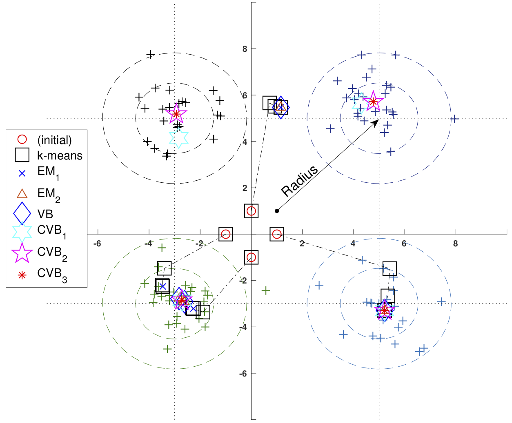
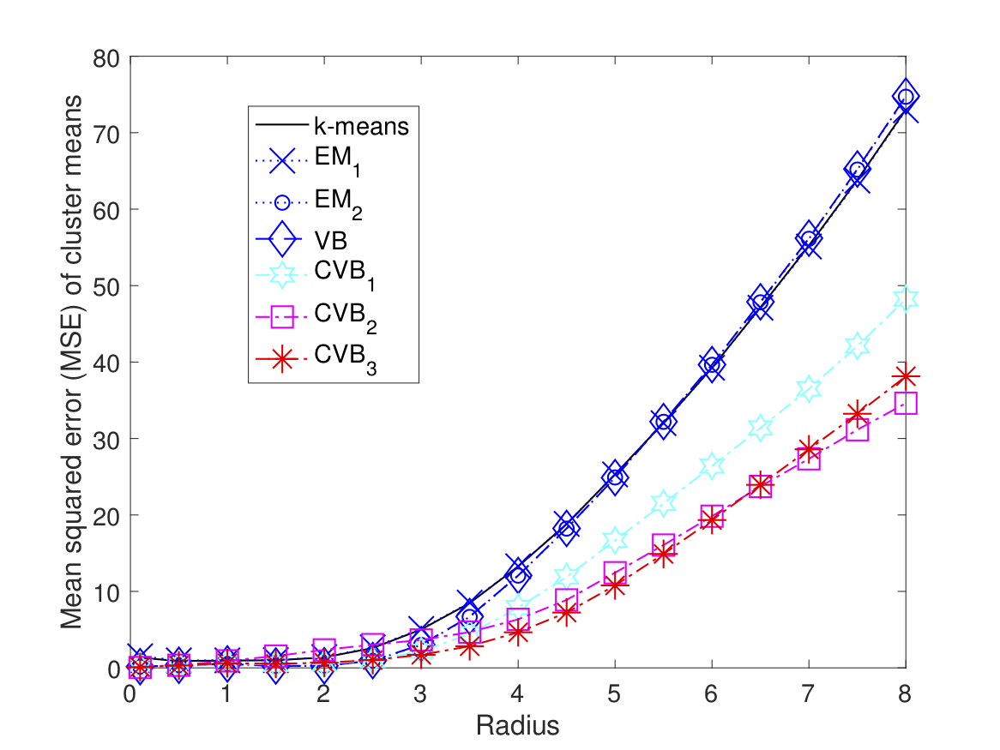
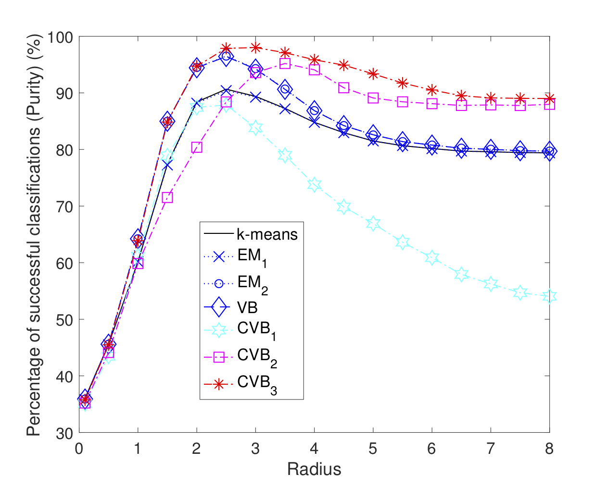
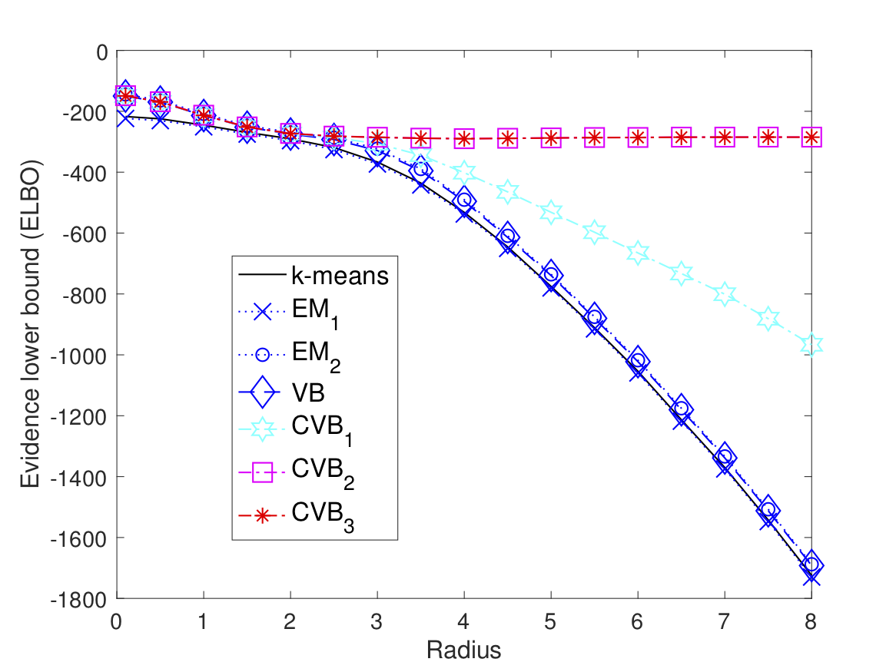

# Copula-Variational-Bayes (CVB) for bivariate Gauss

  
   
  
   

# Reference:

Viet Hung Tran, "Copula Variational Bayes inference via information geometry", IEEE Trans. on information theory 2018 - https://arxiv.org/abs/1803.10998
