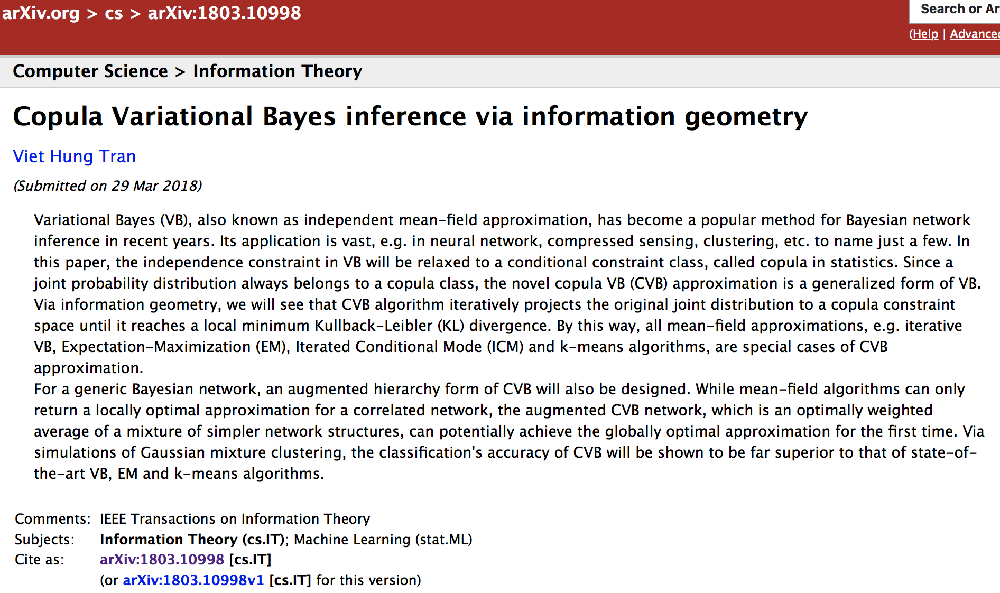
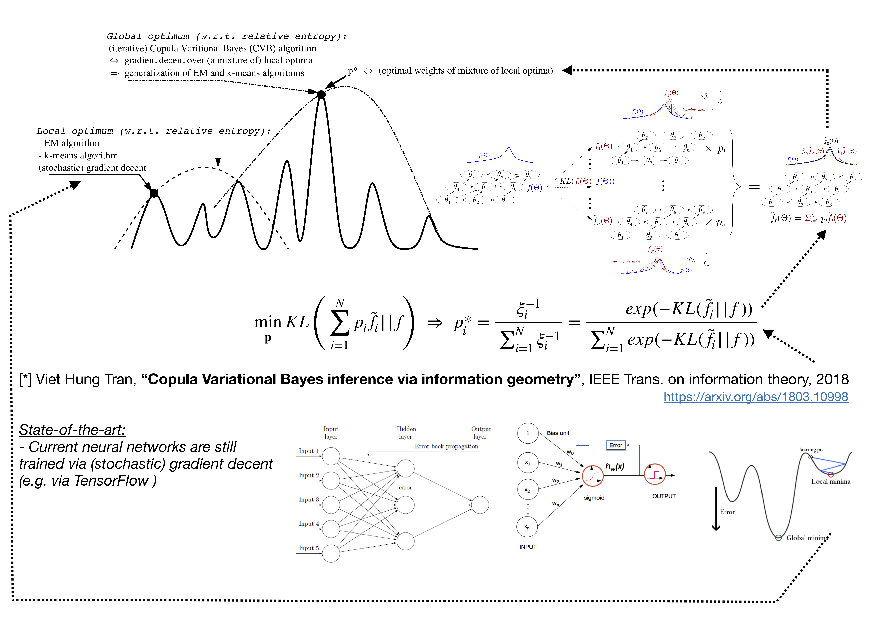

# Copula Variational Bayes inference via information geometry

It took me nearly 10 years to write this paper. This is the generalization of mean-field approximations like Varitional inference (VB), EM algorithm, k-means, iterative mode plug-in, etc. (via Pythagorean form of KL divergence)

I honestly believe Bayes (i.e. causal) network is the next generalization of current NeuralNet. Unlike NeuralNet, there is no overfitting (or, the least overfitting) in BayesNet.

  
  
  

CVB for Gaussian mixture: 

  
   
  
   

CVB for bivariate Gauss:

   
  
  

# Reference:

Viet Hung Tran, "Copula Variational Bayes inference via information geometry", submitted to IEEE Trans. on information theory 2018 - https://arxiv.org/abs/1803.10998

V.H.Tran and W.Wang, "Bayesian inference for PCA and MUSIC algorithms with unknown number of sources", submitted to IEEE Trans. on Signal Processing 2018 https://arxiv.org/abs/1809.10168
