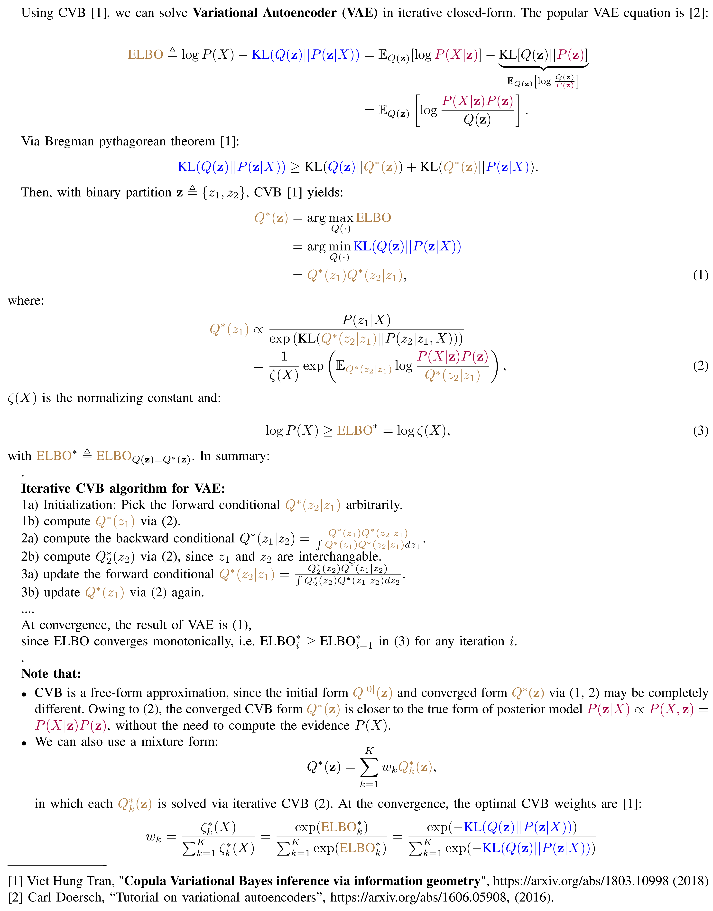
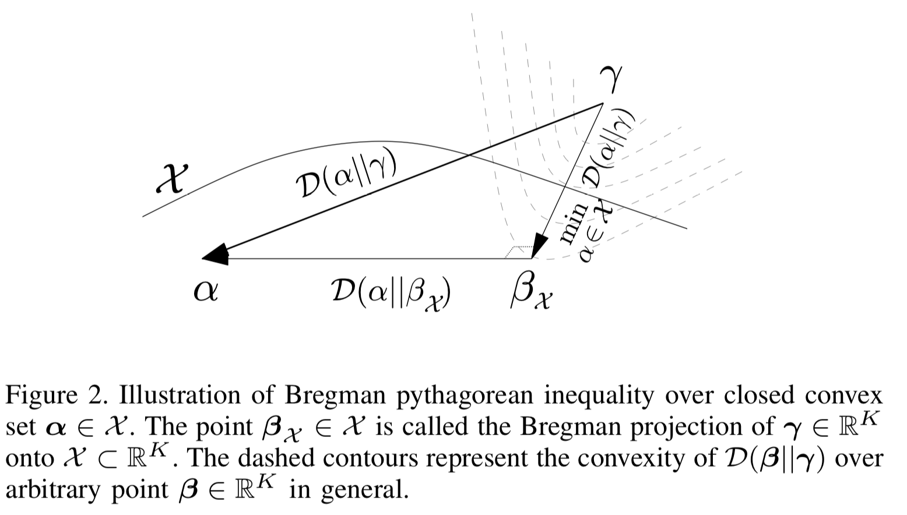
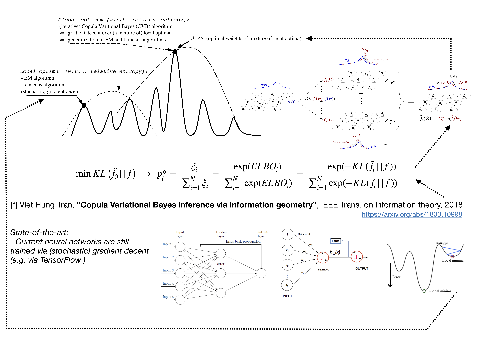

# Copula Variational Bayes inference via information geometry

It took me nearly 10 years to write this paper. This is the generalization of mean-field approximations like Varitional inference (VB), EM algorithm, k-means, iterative mode plug-in, etc. (via Pythagorean form of KL divergence)

The potential application of this CVB algorithm is vast. The CVB can estimate the parameters for many popular machine learning algorithms and high-dimensional problems (e.g. VB, EM, SVM, NeuralNets, Gaussian process, latent mixture models, density estimation, ICA, matrix factorization, dimension reduction, reinforecement learning, etc. to name just a few).

In my paper [1], CVB was shown to improve the accuracy of VB, EM and k-means significantly for Gaussian mixtures.

# Copula Variational Bayes algorithm for Variational Autoencoder (VAE)

Variational Autoencoders [2] is a popular algorithm for estimating weights in deep learning. Nonetheless, the VAE solution was only found via stochastic gradient descent (SGD) method. 

Instead of using gradient decent, let us show that CVB algorithm can be applied to VAE problem and yield iterative closed-form solution directly. 

Since CVB is a relaxed form of mean-field approximation, CVB uses the same tractable iterative scheme, without being constrained by independent form like Variational Bayes method. 

Also, since CVB is a free-form approximation, CVB's form can automatically adapt to the true posterior distribution iteratively until convergence, without being constrained by a fixed distribution like VAE for all iterations. 

Finally, the key advantage of CVB method is that CVB can return an optimal mixture of approximated distributions. By this way, we can decompose the original network into a mixture of approximated networks, whose CVB's optimal weights are simply proportional to the evidence lower bound (ELBO) of each of approximated networks. 

  

  

  
  
  

CVB for Gaussian mixture: 

  
   
  
   

CVB for bivariate Gauss:

   
  
  

# Reference:

Viet Hung Tran, "Copula Variational Bayes inference via information geometry", submitted to IEEE Trans. on information theory 2018 - https://arxiv.org/abs/1803.10998

V.H.Tran and W.Wang, "Bayesian inference for PCA and MUSIC algorithms with unknown number of sources", submitted to IEEE Trans. on Signal Processing 2018 https://arxiv.org/abs/1809.10168
